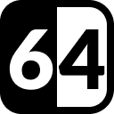
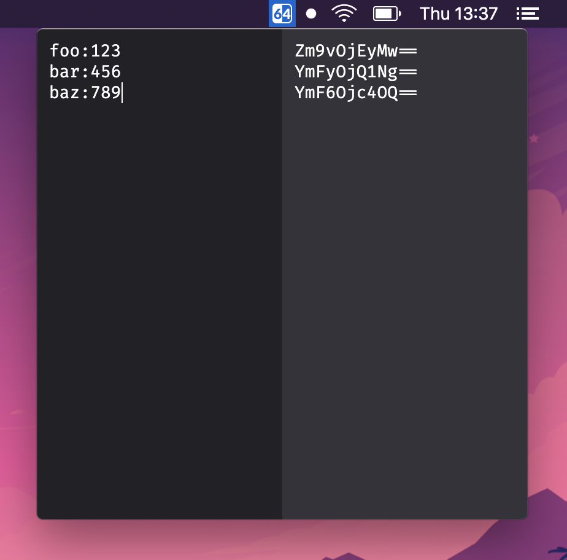

<h3 align="center">sixtyfour</h3>

🤖 Base64 encode/decode menubar application

    
    
    
    

## Installation

Download the latest version of sixtyfour from the **[GitHub releases](https://github.com/jamieweavis/streaker/releases)** page.

## Features

- Live encoding/decoding
- Multiline support

## Screenshot

## License

This project is licensed under the MIT License - see the [LICENSE.md](LICENSE.md) file for details.
