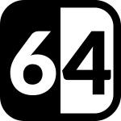

# sixtyfour 

> 🤖 Base64 encode/decode menubar application

## Contents

- [Installation](#installation)
- [Features](#features)
- [Screenshot](#screenshot)

## Installation

Download the latest version of sixtyfour from the **[GitHub releases](https://github.com/jamieweavis/sixtyfour/releases)** page.

## Features

- Live encoding/decoding
- Multiline support

## Screenshot

## License

This project is licensed under the MIT License - see the [LICENSE.md](LICENSE.md) file for details.
